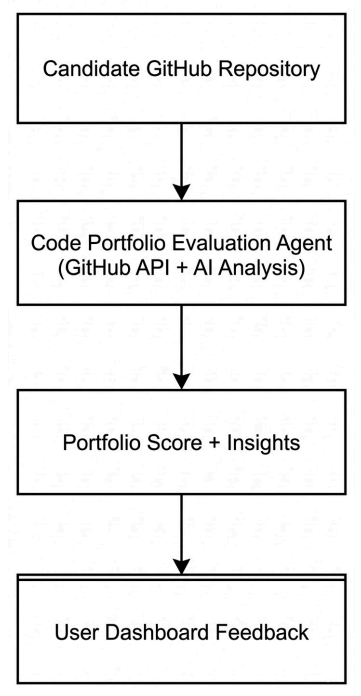

# Code Portfolio Evaluation Agent

An AI-powered system that analyzes GitHub repository and generates portfolio insights to help evaluate technical candidates.
The agent automatically inspects repository structure, technologies used, documentation presence, and project complexity, then produces a **portfolio score and improvement recommendations**.

---

## Problem

Many technical candidates include GitHub repositories in their profiles, but recruiters often do not have the time or technical expertise to evaluate multiple repositories manually. This can lead to inconsistent evaluation and strong candidates being overlooked.

The **Code Portfolio Evaluation Agent** solves this by automatically analyzing repositories and converting technical signals into structured insights.

---

## Features

* GitHub repository analysis using GitHub API
* Automated portfolio scoring based on repository signals
* Strength and improvement insights for projects
* Interactive dashboard for quick repository evaluation
* Live deployed prototype for demonstration

---

## Tech Stack

* **Python**
* **Streamlit**
* **GitHub REST API**
* **Python-dotenv**
* **Requests**
---

## System Workflow

<p align="center">
  
</p>

<p align="center">
Workflow of the Code Portfolio Evaluation Agent
</p>

Steps:

1. User submits a GitHub repository URL
2. GitHub API retrieves repository metadata
3. Repository signals are analyzed (documentation, language, structure)
4. The evaluation agent calculates a portfolio score
4. Repository signals are analyzed (documentation, language, structure)
4. The evaluation agent calculates a portfolio score
5. Strengths and improvement suggestions are generated
6. Results are displayed in the Streamlit dashboard

---

## Live Demo

You can test the **Code Portfolio Evaluation Agent** directly using the live demo.

### Open the App

👉 https://code-portfolio-evaluation-agent.streamlit.app/

## Project Structure

```
code-portfolio-evaluation-agent
│
├── app.py
├── github_analyzer.py
├── scoring.py
├── evaluator.py
├── requirements.txt
├── .env
├── README.md
│
└── assets
    ├── agent_workflow.png
```

---

## Installation

Clone the repository:

```
git clone https://github.com/YOUR_USERNAME/code-portfolio-evaluation-agent.git
cd code-portfolio-evaluation-agent
```

Install dependencies:

```
pip install -r requirements.txt
```

---

## Run the Application

Start the Streamlit app:

```
streamlit run app.py
```

The app will open in your browser:

```
http://localhost:8501
```

---

## Example Usage

Input:

```
https://github.com/username/project
```

Output:

* Portfolio Score
* Strengths of the repository
* Improvement suggestions

---

## Future Improvements

* Analyze multiple repositories from a GitHub profile
* Add deeper code quality metrics
* Detect testing frameworks and CI pipelines
* Improve scoring model with more repository signals